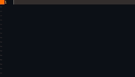

# Snippets for Fountain on Vim
This goes out to all 5 people who write their screenplays with Vim + Fountain
## Installation
1. Install [ultisnips](https://github.com/SirVer/ultisnips)
2. Copy the contents of the *fountain.snippets* file into your Ultisnips file.
## Usage


You can edit the fountain.snippets file on your device to make writing as smooth as possible.
### Basic Functions
The expand trigger will be denoted as `<exp>`
#### Title
`title<exp>` will output a basic title format. By default, it will set the title as the name of your file and the date as today's date.
#### Scene Headings
* `id<exp>` for INT. - DAY
* `in<exp>` for INT. - NIGHT
* `ed<exp>` for EXT. - DAY
* `en<exp>` for EXT. - NIGHT
#### Emphasis
* `it<exp>` to enter italics
* `bf<exp>` to enter boldface
* `un<exp>` to enter underline
#### Boneyard
Say we have a text:
```
MIKE
Hi! My name is Mike! I am from Earth.

We see very clearly that Mike is not from Earth.
```
We select this block with visual mode `v`, and enter `iw`. Then we enter the sequence `<exp>b<exp>` put that text in the boneyard.
```
/*
MIKE
Hi! My name is Mike! I am from Earth.

We see very clearly that Mike is not from Earth.
*/
```
Snippets can be used within Snippets.

May add markdown.snippets support later.
